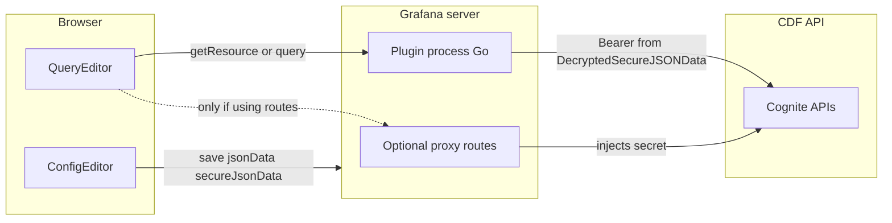

# Authentication strategy: backend queries + frontend discovery

## Constraint from Grafana (and your repo)

Per [Add authentication for data source plugins](https://grafana.com/developers/plugin-tools/how-to-guides/data-source-plugins/add-authentication-for-data-source-plugins), values in `secureJsonData` are **encrypted on save and are not available in the browser afterward**. So after the user saves the data source, the React app **cannot** attach the real API key to a direct `fetch()` to Cognite/CDF.

You already follow this model: [`src/components/ConfigEditor.tsx`](src/components/ConfigEditor.tsx) collects the key into `secureJsonData`, and [`pkg/models/settings.go`](pkg/models/settings.go) reads it via `DecryptedSecureJSONData` in `LoadPluginSettings`. [`pkg/plugin/datasource.go`](pkg/plugin/datasource.go) `CheckHealth` validates the key on the server.

**Interpretation of “auth on frontend and backend”:**

| Layer | What “auth” means | How to implement |
|--------|-------------------|------------------|
| **Frontend** | Users enter secrets and non-secret options; the app triggers **authenticated** operations | Config editor (done) + call **Grafana → plugin backend** (or proxy), not CDF directly with the secret |
| **Backend** | Attach credentials to outbound HTTP to CDF | One shared path: `LoadPluginSettings` + SDK `httpclient` on the `Datasource` instance |

## Recommended approach: one auth path in Go (CallResource + QueryData)

Because [`src/plugin.json`](src/plugin.json) has `"backend": true` and you want efficient server-side timeseries queries, **centralize outbound CDF HTTP in the Go plugin**:

1. **Datasource instance holds an `*http.Client`**  
   In [`pkg/plugin/datasource.go`](pkg/plugin/datasource.go) `NewDatasource`, use `settings.HTTPClientOptions(ctx)` and `httpclient.New(opts)` from the Grafana plugin SDK (as in the doc’s “Forward OAuth identity” example if you later need `oauthPassThru`). Reuse one client per instance for connection pooling.

2. **Timeseries queries**  
   Keep using `QueryData` in [`pkg/plugin/datasource.go`](pkg/plugin/datasource.go): load settings with `LoadPluginSettings`, set `Authorization` (or Cognite’s required headers) on requests to CDF, parse responses into frames. Batch or parallelize inside one `QueryData` call as needed for efficiency.

3. **Discovery (“available timeseries”) from the UI**  
   Implement **`backend.CallResourceHandler`** on the same `Datasource` type and register it in the datasource manage setup (alongside `QueryData` / `CheckHealth`). Expose narrow JSON endpoints, e.g. `GET /resource/timeseries?...`, that:
   - read `req.PluginContext.DataSourceInstanceSettings` / same `LoadPluginSettings` pattern,
   - call CDF list/search APIs,
   - return JSON to the panel/query editor.

   On the frontend, [`src/datasource.ts`](src/datasource.ts) `DataSourceWithBackend` already extends the class that can call the plugin resource API—add thin methods (e.g. `listTimeSeries(filter)`) that delegate to `getResource` / the documented resource request pattern for your Grafana major version.

**Why this over proxy-only for discovery:** one place for base URL, headers, error handling, and future OAuth/cookies; no duplication between `plugin.json` routes and Go. Proxy routes remain valid per the same doc if you prefer Grafana to rewrite URLs for simple GETs.

## Optional: proxy routes in `plugin.json`

Use [proxy routes](https://grafana.com/developers/plugin-tools/how-to-guides/data-source-plugins/add-authentication-for-data-source-plugins) with `headers` / `tokenAuth` when:

- discovery is a few simple GETs and you want zero Go for those paths, or  
- you need something the proxy supports out of the box (e.g. OAuth client credentials via `tokenAuth`).

Tradeoff: you still implement **backend** `QueryData` with the same secrets for efficient series fetch unless everything goes through the proxy—so you often end up maintaining **two** outbound mechanisms unless you standardize on one.

## Health check and UX

- Extend `CheckHealth` in [`pkg/plugin/datasource.go`](pkg/plugin/datasource.go) to perform a **lightweight authenticated request** to CDF (not only “non-empty key”) so misconfiguration fails fast.
- Keep non-sensitive instance config in `jsonData` (e.g. CDF project, cluster URL) via [`src/types.ts`](src/types.ts) `MyDataSourceOptions`; align field names with [`pkg/models/settings.go`](pkg/models/settings.go) `PluginSettings` (e.g. legacy `path`) or expand the struct as needed.

## Phase 1 (concrete): login flow + endpoint mode (no interactive redirect)

**Scope:** Support **device code (default)**, **client credentials**, and **bearer token** only. Defer interactive authorization-code redirect.

### Step 1 — Login flow selector

Single control at the top of [`src/components/ConfigEditor.tsx`](src/components/ConfigEditor.tsx) (e.g. `RadioButtonGroup` or `Select`):

| Value | Label (suggested) | User provides |
|--------|-------------------|---------------|
| `device_code` | Device code (default) | Endpoint block + device sign-in via `CallResource` (later) |
| `client_credentials` | Client credentials | Endpoint block + Client ID + Client secret |
| `token` | Bearer token | Access token only (single `SecretInput`) |

Store in `jsonData.authMethod` (string union in [`src/types.ts`](src/types.ts)).

### Step 2 — “Shortcut” vs “full”: naming

“Shortcut / full” is vague. Prefer labels that describe **what differs**:

| Internal key | User-facing label | Meaning |
|----------------|-------------------|--------|
| `guided` | **Guided (Cognite defaults)** or **Use standard Cognite URLs** | User picks **provider**, **CDF project**, **cluster**, and (if Entra) **Microsoft Entra tenant ID**. Plugin derives token endpoint defaults, CDF API base URL, and default **audience** / **scopes** from Cognite’s documented URL patterns. |
| `manual` | **Manual OIDC** or **Custom token endpoint** | User enters **token URL**, **audience**, and **scopes** instead of cluster-based derivation. |

Alternative pair if you want shorter copy: **“Cluster (guided)”** vs **“Token URL (advanced)”**. Internal name stays `guided` | `manual` in code.

Store in `jsonData.endpointMode` (or `cdfEndpointMode` if you want explicit namespacing).

### Step 3 — Fields by combination

**A. `authMethod === 'token'`**

- Show **only** access token: `SecretInput` mapped to `secureJsonData.accessToken` (or keep `apiKey` as alias during migration—prefer a dedicated key for clarity).
- Hide endpoint mode switch and all guided/manual OIDC fields (token flow assumes user already has a bearer token; optional later: allow optional CDF base URL in `jsonData` if you need non-default API host).

**B. `authMethod === 'client_credentials'` or `authMethod === 'device_code'`**

1. **Endpoint mode**

- **Guided:** show **Provider** (select), **CDF project**, **Cluster** (string as today: logical cluster / region name per Cognite conventions), and **Entra tenant ID** only when `provider === 'entra'` (or label “Microsoft Entra (Azure AD)”).
- **Manual:** hide provider/cluster/tenant block; show **Token URL**, **Audience**, **Scopes** (strings in `jsonData`; validate non-empty on save / in `CheckHealth`).

2. **Client credentials only**

- **Client ID** → `jsonData.clientId` (not secret).
- **Client secret** → `secureJsonData.clientSecret` with `secureJsonFields` reset pattern like the existing API key.

3. **Device code**

- Same guided/manual endpoint fields as client credentials (both flows need token endpoint + audience/scopes, either derived or explicit).
- UI later: “Sign in” + polling; tokens written to `secureJsonData` before Save (see CDF auth table above). Implement under `call-resource-auth` todo.

### Step 4 — `jsonData` / `secureJsonData` sketch

**`jsonData` (non-secret, Viewer-visible—no secrets):**

- `authMethod`: `'device_code' | 'client_credentials' | 'token'`
- `endpointMode`: `'guided' | 'manual'` (ignored or omitted when `authMethod === 'token'`)
- Guided: `provider`, `cdfProject`, `cluster`, `entraTenantId?`
- Manual: `tokenUrl`, `audience`, `scopes` (scopes: single string space-separated, or array serialized—pick one and match Go)
- Client credentials: `clientId`

**`secureJsonData`:**

- Token flow: `accessToken` (or legacy `apiKey` migration).
- Client credentials: `clientSecret`
- Device code result (phase 1b): `refreshToken` / `accessToken` as applicable after exchange; never put these in `jsonData`.

Align [`pkg/models/settings.go`](pkg/models/settings.go) unmarshalling and `loadSecretPluginSettings` with the new keys; remove or repurpose the old single `path` field if it was only a placeholder—either map `path` to `cluster` or migrate in `LoadPluginSettings`.

### Step 5 — Backend responsibilities

- **`url-resolution-go`:** For `guided`, implement a single function (e.g. `ResolveCDFAuthEndpoints`) that returns `{ cdfBaseURL, tokenURL, audience, scopes }` from provider + project + cluster + optional Entra tenant, using **Cognite’s public URL rules** (document constants with links to Cognite docs in code comments). For `manual`, read the three fields from settings as-is.
- **`http-client-instance`:** Build HTTP transport; for client credentials, token refresh in-process; for device code + refresh token, same; for static token, set `Authorization: Bearer` from `accessToken`.
- **`checkhealth-real`:** Branch validation: required fields per `authMethod` and `endpointMode`; then optional authenticated ping to CDF.

### Step 6 — Implementation order

1. Types + `LoadPluginSettings` + `CheckHealth` validation skeleton (fail fast on missing combos).
2. `ConfigEditor` layout and `onOptionsChange` wiring (no device-code HTTP yet).
3. Go URL resolution + client credentials token request (no CDF data yet if needed to unblock).
4. `CallResource` device flow + minimal frontend poll.
5. Discovery + `QueryData` against CDF.

## CDF auth modes: what Grafana can and cannot do

Cognite/CDF supports several auth paths. In a **Grafana data source plugin**, anything secret must still be established or refreshed **on the server** (`DecryptedSecureJSONData`, token exchange in Go). The UI’s role is to **display instructions** and **drive** flows by calling the backend; it does not receive saved secrets after save.

| Mode | Feasible in Grafana? | Typical pattern |
|------|----------------------|-----------------|
| **Client ID + secret** (client credentials) | Yes | Store in `secureJsonData`; acquire tokens in Go (`QueryData` / shared client). Proxy `tokenAuth` is also an option for outbound HTTP shaped like client credentials ([Grafana auth doc](https://grafana.com/developers/plugin-tools/how-to-guides/data-source-plugins/add-authentication-for-data-source-plugins)). |
| **Token directly** (Bearer / OIDC token) | Yes | User pastes into `SecretInput` before save; after save, only backend uses it. Or short-lived token returned once from `CallResource` then written into options before user clicks **Save** (still ends up in `secureJsonData`). |
| **Device code** | **Yes, with design** | Backend starts the device flow and returns `verification_uri`, `user_code`, and an **opaque session id** (or similar) in the JSON body of a `CallResource` response; the config editor shows those strings and **polls** another resource route until the backend completes the token poll against Cognite. On success, either return tokens to the UI **only until the next Save** (then merge into `secureJsonData` via `onOptionsChange`) or document that the user must save after sign-in. Sensitive refresh material must land in `secureJsonData`, not `jsonData`. |
| **Interactive / authorization code** (browser redirect, `?code=`) | **Partially / awkward** | Data source plugins do **not** get a first-class public `redirect_uri` registered as “the plugin” the way a standalone web app does. Practical options: (1) **Reuse the user’s Grafana login** if the IdP and token work for CDF: `jsonData.oauthPassThru` + SDK HTTP client with `ForwardHTTPHeaders` ([same doc](https://grafana.com/developers/plugin-tools/how-to-guides/data-source-plugins/add-authentication-for-data-source-plugins))—only works when the Grafana user token is acceptable to CDF. (2) **Device code** instead of redirect. (3) **External** sign-in + paste token or client credentials. Community discussion reflects that full authorization-code UX inside a datasource is non-standard and often implemented via backend + resource handlers ([forum thread](https://community.grafana.com/t/data-source-plugin-login-with-oauth2-authorization-code-grant-type/45859)). |

**Passing values “back to the frontend”:** Yes. `CallResource` / resource requests are the supported channel: the browser calls the plugin through Grafana, and the handler returns JSON (or HTML) that React can render—device codes, URLs, errors, or “not yet authenticated” states. That is **not** the same as exposing **saved** long-lived secrets to the frontend after configuration is persisted.

## Summary

- **Phase 1 config:** Three login flows (**device code** default, **client credentials**, **token**); for the first two, add **guided vs manual OIDC** (`endpointMode`) with the field matrix above; **token** flow is access token only.
- **Proceed** by implementing **server-side HTTP with decrypted secrets** for both **QueryData** and **CallResource**; use the **frontend** only for config and for calling those backend endpoints—**not** for holding or sending saved secrets to CDF directly after save.
- For **device code**, use **CallResource + polling + `onOptionsChange` before Save** so refresh/access material lands in `secureJsonData`.
- **Interactive authorization code** remains out of scope for this phase; later options unchanged (`oauthPassThru`, device code, etc.).
- **Proxy routes:** optional; still only if you split traffic deliberately.
